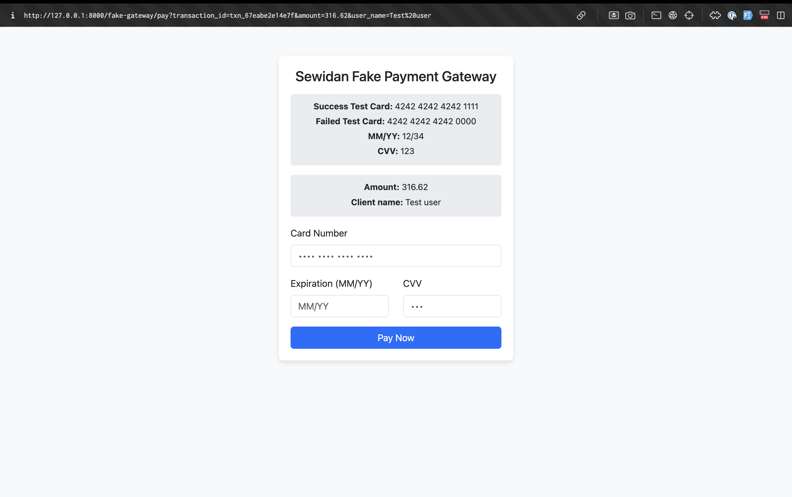

# Order and Payment Management API

## Overview
This Laravel-based API provides order and payment management functionality with a focus on clean code principles and extensibility. The system allows for easy integration of new payment gateways using the strategy pattern.

## Setup Instructions

### Docker Setup (Recommended)
1. Clone the repository:
   ```bash
   git clone https://github.com/MostafaSewidan/tocaan_extendable_order_payment_api_task.git
   cd tocaan_extendable_order_payment_api_task
   ```
2. Run the following commands:
   ```bash
   docker-compose up -d
   docker-compose exec app php artisan key:generate
   docker-compose exec app php artisan jwt:secret
   docker-compose exec app php artisan migrate --seed
   ```
3. The API will be available at: [http://localhost:8000](http://localhost:8000)

### Local Setup (Without Docker)
1. Clone the repository:
   ```bash
   git clone <repository-url>
   cd <repository-folder>
   ```
2. Ensure you have PHP 8.2 and Composer installed.
3. Run the following commands:
   ```bash
   composer install
   php artisan key:generate
   php artisan jwt:secret
   php artisan migrate --seed
   composer run dev
   ```
4. The API will be available at: [http://localhost:8000](http://localhost:8000)

## Payment Gateway Extensibility
The system is designed to easily accommodate new payment gateways with minimal code changes.

### Architecture
- **Strategy Pattern**: The system uses the strategy pattern to implement different payment gateways.
- **Contracts**: All payment gateways must implement the `OrderPaymentInterface`, which defines two required methods:
  ```php
  checkout(Order $order): CheckoutResponse
  callBack(Request $request): CallBackResponse
  ```

### Adding a New Payment Gateway
1. Create a new service class in `App\Services\Payments` that implements `OrderPaymentInterface`.
2. Implement the required methods:
   - `checkout()`: Handles the initial payment request.
   - `callBack()`: Processes the payment callback.
3. Update the `getGateway()` method in `PaymentService.php` to include your new gateway:
   ```php
   return match ($paymentType) {
       'sewidan_fake' => new SewidanFakePaymentService(),
       'new_gateway' => new NewGatewayPaymentService(), // Add your new gateway here
       default => throw new HttpException(400, 'Invalid payment type'),
   };
   ```

### Example Gateway Implementation

The system includes a `SewidanFakeGateway` as an example implementation:
- Uses test card numbers for simulation (`4242 4242 4242 1111` for success, `4242 4242 4242 0000` for failure).
- Implements both `checkout` and `callback` functionality.
- Demonstrates the required response formats using `CheckoutResponse` and `CallBackResponse` DTOs.

## API Documentation
The Postman collection documents all available endpoints, including:
- **Authentication** (register, login, refresh token, logout)
- **Order management** (create, update, delete, list)
- **Payment processing**
- **Product listing**

### Key Endpoints:
```plaintext
POST   /api/auth/register       - User registration
POST   /api/auth/login          - User login
POST   /api/auth/refresh        - User refresh token
POST   /api/auth/logout         - User logout
POST   /api/orders              - Create order
GET    /api/orders              - List orders
DELETE /api/orders/{orderId}    - delete orders
```

## Testing
The system includes:
- **Unit tests** for core functionality.
- **Feature tests** for API endpoints.
- **Payment gateway simulation tests**.

To run tests:
```bash
php artisan test
```

## Assumptions & Notes
- **Authentication**: JWT authentication is used for all protected endpoints.
- **Order Status**: Payments can only be processed for orders in "confirmed" status.
- **Order Deletion**: Orders with associated payments cannot be deleted.
- **Fake Gateway**: The `SewidanFakeGateway` is provided for testing purposes with simulated success/failure responses.
- **Environment**: Configuration for payment gateways should be stored in `.env` or a database configuration table.
- **Error Handling**: Comprehensive error messages are provided for validation failures and business rule violations.

## Project Structure
Key directories:
- `App/Services/Payments` - Contains payment gateway implementations.
- `App/DTO/Payment` - Data transfer objects for payment responses.
- `App/Enums` - Status enumerations.
- `App/Http/Controllers/Api` - API controllers.
- `App/Repositories` - Data access layer.
- `App/Models` - Database models.

## Postman Documentation
The attached Postman collection includes:
- Detailed request/response examples.
- Success and error cases.
- Organized endpoint groups.
- Authentication examples.

### To use:
1. Import the Postman collection.
2. Set the base URL to your local instance.
3. Start with the authentication endpoints to get a JWT token.
4. You can find the Postman collection in the repository at: `docs/task.postman_collection.json`
